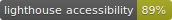
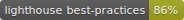
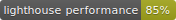
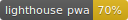
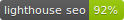

# Nuxtit

[](https://travis-ci.com/Nuxtit/Nuxtit)
[](https://greenkeeper.io/)
[](https://developers.google.com/speed/pagespeed/insights/?url=https%3A%2F%2Fnuxtit.netlify.com%2F)
[](https://developers.google.com/speed/pagespeed/insights/?url=https%3A%2F%2Fnuxtit.netlify.com%2F)
[](https://developers.google.com/speed/pagespeed/insights/?url=https%3A%2F%2Fnuxtit.netlify.com%2F)
[](https://developers.google.com/speed/pagespeed/insights/?url=https%3A%2F%2Fnuxtit.netlify.com%2F)
[](https://developers.google.com/speed/pagespeed/insights/?url=https%3A%2F%2Fnuxtit.netlify.com%2F)

> Webapp Reddit Client written in Vue/Nuxt

This app is in EARLY ALPHA, expect bugs and missing features.

[https://nuxtit.netlify.com](https://nuxtit.netlify.com)

[Find us on Reddit](https://old.reddit.com/r/Nuxtit/)

## Build Setup

``` bash
# copy .env and set desired settings
$ cp .env.example .env

# install dependencies
$ yarn install

# serve with hot reload at localhost:3000
$ yarn run dev

# build for production and launch server
$ yarn run build
$ yarn start

# generate static project
$ yarn run generate
```

For detailed explanation on how things work, checkout [Nuxt.js docs](https://nuxtjs.org).

## Features

Browse Reddit! We're working to add the majority of basic features to reduce the amount of times you need to leave the app. There is a lot of work left to to do! Most places will have a link allowing you to quickly goto reddit while we still have a lot of work to do. (Update!) We have so many things implemented (voting, commenting, crossposting, mod stuff, etc.) that you should open an issue if you want something specific.


Use settings menu to quickly censor usernames for screenshots. Note that you can tell which two posts were posted by the same user because of the color. Now you don't have to figure out how photoshop works on your phone just to censor usernames (do not get yourself in trouble for doxxing/brigading!). We'll leave the censor usernames feature on for our screenshots.


Sign into multiple accounts.

You can search things via reddit search or via pushshift.


Tap the thumbnail to see image enlarged under the post.


Add things to your "Queue" so you don't have to open 100+ tabs


